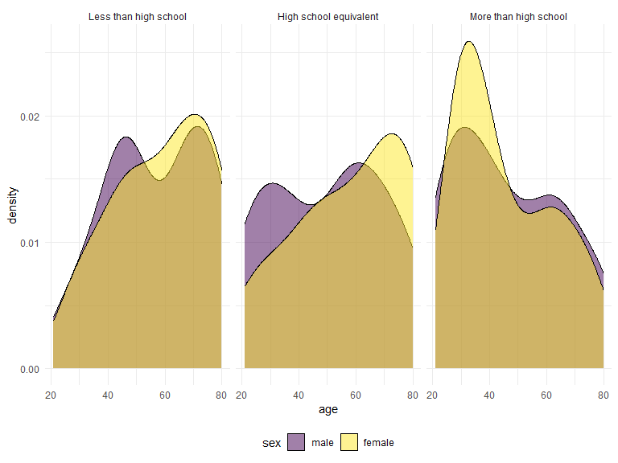

Homework 3
================
Yunshen Bai
2023-10-14

## Problem 1

### Read in the data

``` r
data("instacart")

instacart = 
  instacart |> 
  as_tibble()
```

### Answer questions about the data

This dataset contains 1384617 rows and 15 columns, with each row
resprenting a single product from an instacart order. Variables include
identifiers for user, order, and product; the order in which each
product was added to the cart. There are several order-level variables,
describing the day and time of the order, and number of days since prior
order. Then there are several item-specific variables, describing the
product name (e.g. Yogurt, Avocado), department (e.g. dairy and eggs,
produce), and aisle (e.g. yogurt, fresh fruits), and whether the item
has been ordered by this user in the past. In total, there are 39123
products found in 131209 orders from 131209 distinct users.

Below is a table summarizing the number of items ordered from aisle. In
total, there are 134 aisles, with fresh vegetables and fresh fruits
holding the most items ordered by far.

``` r
instacart |> 
  count(aisle) |> 
  arrange(desc(n))
```

    ## # A tibble: 134 x 2
    ##    aisle                              n
    ##    <chr>                          <int>
    ##  1 fresh vegetables              150609
    ##  2 fresh fruits                  150473
    ##  3 packaged vegetables fruits     78493
    ##  4 yogurt                         55240
    ##  5 packaged cheese                41699
    ##  6 water seltzer sparkling water  36617
    ##  7 milk                           32644
    ##  8 chips pretzels                 31269
    ##  9 soy lactosefree                26240
    ## 10 bread                          23635
    ## # i 124 more rows

Next is a plot that shows the number of items ordered in each aisle.
Here, aisles are ordered by ascending number of items.

``` r
instacart |> 
  count(aisle) |> 
  filter(n > 10000) |> 
  mutate(aisle = fct_reorder(aisle, n)) |> 
  ggplot(aes(x = aisle, y = n)) + 
  geom_point() + 
  labs(title = "Number of items ordered in each aisle") +
  theme(axis.text.x = element_text(angle = 60, hjust = 1))
```


Our next table shows the three most popular items in aisles
`baking ingredients`, `dog food care`, and `packaged vegetables fruits`,
and includes the number of times each item is ordered in your table.

``` r
instacart |> 
  filter(aisle %in% c("baking ingredients", "dog food care", "packaged vegetables fruits")) |>
  group_by(aisle) |> 
  count(product_name) |> 
  mutate(rank = min_rank(desc(n))) |> 
  filter(rank < 4) |> 
  arrange(desc(n)) |>
  knitr::kable()
```

| aisle                      | product_name                                  |    n | rank |
|:---------------------------|:----------------------------------------------|-----:|-----:|
| packaged vegetables fruits | Organic Baby Spinach                          | 9784 |    1 |
| packaged vegetables fruits | Organic Raspberries                           | 5546 |    2 |
| packaged vegetables fruits | Organic Blueberries                           | 4966 |    3 |
| baking ingredients         | Light Brown Sugar                             |  499 |    1 |
| baking ingredients         | Pure Baking Soda                              |  387 |    2 |
| baking ingredients         | Cane Sugar                                    |  336 |    3 |
| dog food care              | Snack Sticks Chicken & Rice Recipe Dog Treats |   30 |    1 |
| dog food care              | Organix Chicken & Brown Rice Recipe           |   28 |    2 |
| dog food care              | Small Dog Biscuits                            |   26 |    3 |

Finally is a table showing the mean hour of the day at which Pink Lady
Apples and Coffee Ice Cream are ordered on each day of the week. This
table has been formatted in an untidy manner for human readers. Pink
Lady Apples are generally purchased slightly earlier in the day than
Coffee Ice Cream, with the exception of day 5.

``` r
instacart |>
  filter(product_name %in% c("Pink Lady Apples", "Coffee Ice Cream")) |>
  group_by(product_name, order_dow) |>
  summarize(mean_hour = mean(order_hour_of_day)) |>
  pivot_wider(
    names_from = order_dow, 
    values_from = mean_hour) |>
  knitr::kable(digits = 2)
```

    ## `summarise()` has grouped output by 'product_name'. You can override using the
    ## `.groups` argument.

| product_name     |     0 |     1 |     2 |     3 |     4 |     5 |     6 |
|:-----------------|------:|------:|------:|------:|------:|------:|------:|
| Coffee Ice Cream | 13.77 | 14.32 | 15.38 | 15.32 | 15.22 | 12.26 | 13.83 |
| Pink Lady Apples | 13.44 | 11.36 | 11.70 | 14.25 | 11.55 | 12.78 | 11.94 |

## Problem 2

### Read the data

First, do some data cleaning:

- format the data to use appropriate variable names;
- focus on the “Overall Health” topic
- include only responses from “Excellent” to “Poor”
- organize responses as a factor taking levels ordered from “Poor” to
  “Excellent”

``` r
data("brfss_smart2010")
brfss_smart2010=
  brfss_smart2010 |>
  janitor::clean_names()|>
  rename(state=locationabbr,county=locationdesc)|>
  filter(topic == "Overall Health")|>
  mutate(response=factor(response,levels = c("Poor", "Fair", "Good", "Very good", "Excellent"),ordered = TRUE))
```

### In 2002, which states were observed at 7 or more locations? What about in 2010?

``` r
more_7_loc_2002=
  brfss_smart2010|>
  filter(year==2002)|>
  group_by(state)|>
  summarize(n_obs=n_distinct(county))|>
  filter(n_obs>=7)
more_7_loc_2002
```

    ## # A tibble: 6 x 2
    ##   state n_obs
    ##   <chr> <int>
    ## 1 CT        7
    ## 2 FL        7
    ## 3 MA        8
    ## 4 NC        7
    ## 5 NJ        8
    ## 6 PA       10

Form this result, CT, FL, MA, NC, NJ, PA were observed at 7 or more
locations in 2002.

What about in 2010?

``` r
more_7_loc_2010=
  brfss_smart2010|>
  filter(year==2010)|>
  group_by(state)|>
  summarize(n_obs=n_distinct(county))|>
  filter(n_obs>=7)
more_7_loc_2010
```

    ## # A tibble: 14 x 2
    ##    state n_obs
    ##    <chr> <int>
    ##  1 CA       12
    ##  2 CO        7
    ##  3 FL       41
    ##  4 MA        9
    ##  5 MD       12
    ##  6 NC       12
    ##  7 NE       10
    ##  8 NJ       19
    ##  9 NY        9
    ## 10 OH        8
    ## 11 PA        7
    ## 12 SC        7
    ## 13 TX       16
    ## 14 WA       10

Form this result, CA, CO, FL, MA, MD, NC, NE, NJ, NY, OH, PA, SC, TX, WA
were observed at 7 or more locations in 2010.

### Construct a dataset that is limited to Excellent responses, and contains, year, state, and a variable that averages the data_value across locations within a state. Make a “spaghetti” plot of this average value over time within a state.

``` r
ave_data_value_summ=
  brfss_smart2010|>
  filter(response=="Excellent")|>
  group_by(year,state)|>
  summarize(ave_data_value=mean(data_value))
ave_data_value_summ
```

    ## # A tibble: 443 x 3
    ## # Groups:   year [9]
    ##     year state ave_data_value
    ##    <int> <chr>          <dbl>
    ##  1  2002 AK              27.9
    ##  2  2002 AL              18.5
    ##  3  2002 AR              24.1
    ##  4  2002 AZ              24.1
    ##  5  2002 CA              22.7
    ##  6  2002 CO              23.1
    ##  7  2002 CT              29.1
    ##  8  2002 DC              29.3
    ##  9  2002 DE              20.9
    ## 10  2002 FL              25.7
    ## # i 433 more rows

``` r
ave_data_value_summ|>
  ggplot(aes(x=year,y=ave_data_value,color=state))+
  theme_bw() + 
  geom_line()+
  labs(
    title = "Spaghetti plot of average data value over time within a state",
    x = "Year",
    y = "Average data value",
    color = "State"
  )+
  viridis::scale_color_viridis(
    name = "State", 
    discrete = TRUE
  )
```


### Make a two-panel plot showing, for the years 2006, and 2010, distribution of data_value for responses (“Poor” to “Excellent”) among locations in NY State.

``` r
plot_2006=
  brfss_smart2010|>
  filter(year==2006,state=="NY")|>
  ggplot(aes(x=data_value,fill=response))+
  theme_bw()+
  geom_density(alpha = .5)+
  labs(
    title = "Distribution of data_value in 2006"
  )+
  theme(legend.position = "none")

plot_2010=
  brfss_smart2010|>
  filter(year==2010,state=="NY")|>
  ggplot(aes(x=data_value,fill=response))+
  theme_bw()+
  geom_density(alpha = .5)+
  labs(
    title = "Distribution of data_value in 2010"
  )

plot_2006+plot_2010
```


## Problem 3

read data

``` r
accel=read_csv("./data/nhanes_accel.csv")
covar=read_csv("./data/nhanes_covar.csv",skip = 4)
```

Tidy, merge, and otherwise organize the data sets.

``` r
mims=
  left_join(covar,accel)|>
  mutate(sex=recode_factor(sex,'1'="male",'2'="female"),
         education=recode_factor(education,
                                 '1'="Less than high school",
                                 '2'="High school equivalent",
                                 '3'="More than high school"))|>
  drop_na(min1:min1440)|>
  pivot_longer(
    min1:min1440,
    names_to = "min",
    values_to = "mims"
  )|>
  filter(age>=21)
```

### Produce a reader-friendly table for the number of men and women in each education category, and create a visualization of the age distributions for men and women in each education category. Comment on these items.

``` r
mims|>
  group_by(sex,education)|>
  summarize(n_obs=n_distinct(SEQN))
```

    ## `summarise()` has grouped output by 'sex'. You can override using the `.groups`
    ## argument.

    ## # A tibble: 6 x 3
    ## # Groups:   sex [2]
    ##   sex    education              n_obs
    ##   <fct>  <fct>                  <int>
    ## 1 male   Less than high school     28
    ## 2 male   High school equivalent    36
    ## 3 male   More than high school     56
    ## 4 female Less than high school     29
    ## 5 female High school equivalent    23
    ## 6 female More than high school     59

``` r
mims|>
  distinct(SEQN,.keep_all = TRUE)|>
  ggplot(aes(x=age,fill=sex))+
  geom_density(alpha = .5) + 
  facet_grid(~education) + 
  viridis::scale_fill_viridis(discrete = TRUE)
```


From the numbers and distributions for men and women in each education
category, we can observe that the number of men in High school
equivalent level is obviously higher than the number of women in High
school equivalent level. The average age of women in Less than high
school level and High school equivalent level is higher than women.
However, the average age of women in More than high school level is
smaller than man. For men and women, there are more young people among
highly educated people.

### Using your tidied dataset, aggregate across minutes to create a total activity variable for each participant.

``` r
Traditional_analyses=
  mims|>
  group_by(SEQN,sex,age,education)|>
  summarize(ave_mims=mean(mims))
Traditional_analyses
```

    ## # A tibble: 231 x 5
    ## # Groups:   SEQN, sex, age [231]
    ##     SEQN sex      age education              ave_mims
    ##    <dbl> <fct>  <dbl> <fct>                     <dbl>
    ##  1 62161 male      22 High school equivalent     9.16
    ##  2 62164 female    44 More than high school      9.31
    ##  3 62169 male      21 High school equivalent     6.94
    ##  4 62174 male      80 More than high school      5.96
    ##  5 62177 male      51 High school equivalent     8.28
    ##  6 62178 male      80 High school equivalent     5.20
    ##  7 62180 male      35 More than high school      9.86
    ##  8 62184 male      26 High school equivalent     9.44
    ##  9 62189 female    30 More than high school     12.9 
    ## 10 62191 male      70 High school equivalent     5.07
    ## # i 221 more rows

### Plot these total activities (y-axis) against age (x-axis); your plot should compare men to women and have separate panels for each education level. Include a trend line or a smooth to illustrate differences. Comment on your plot.

``` r
Traditional_analyses|>
  ggplot(aes(x=age,y=ave_mims,color=sex))+
  geom_point()+
  geom_smooth(se = FALSE)+
  facet_grid(. ~ education)
```

    ## `geom_smooth()` using method = 'loess' and formula = 'y ~ x'


